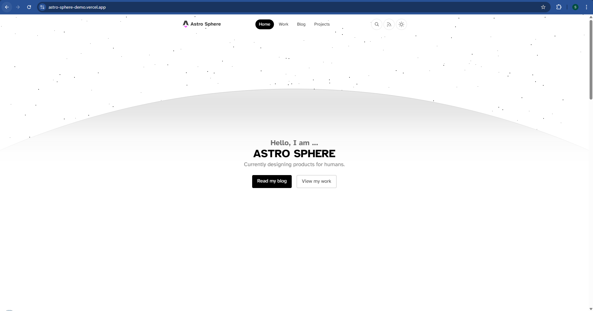
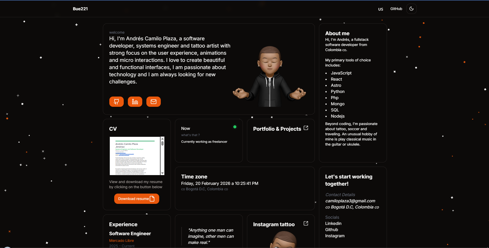
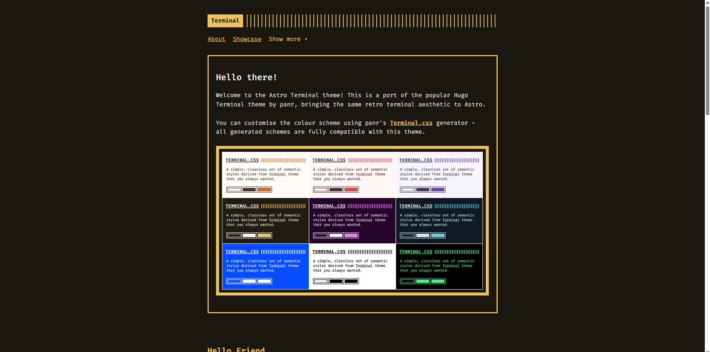
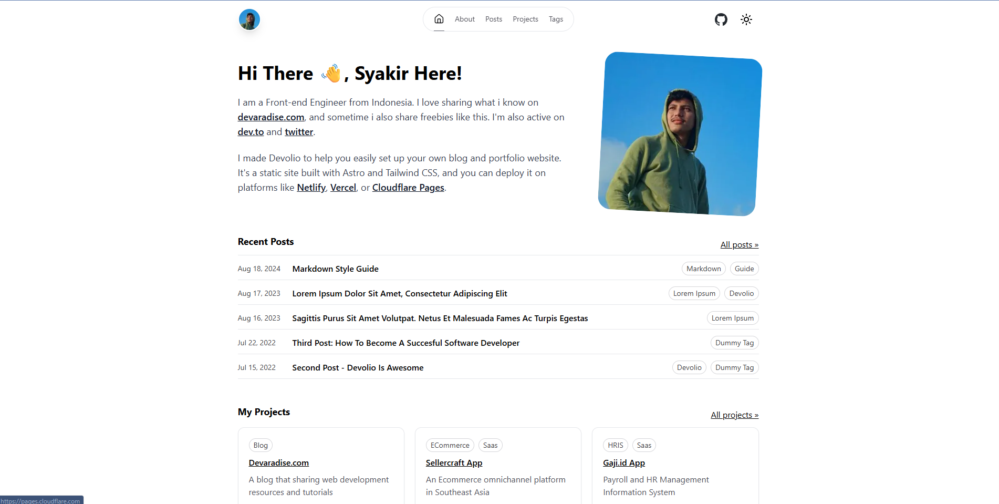
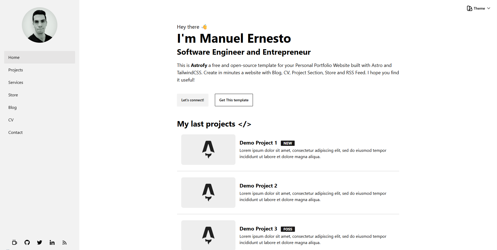
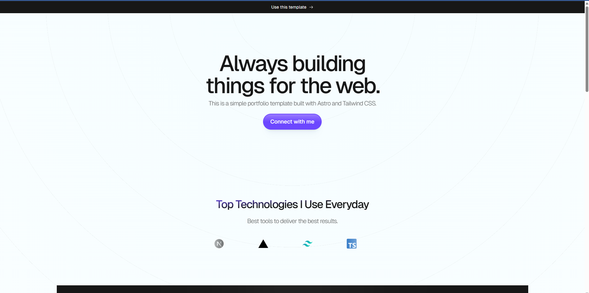
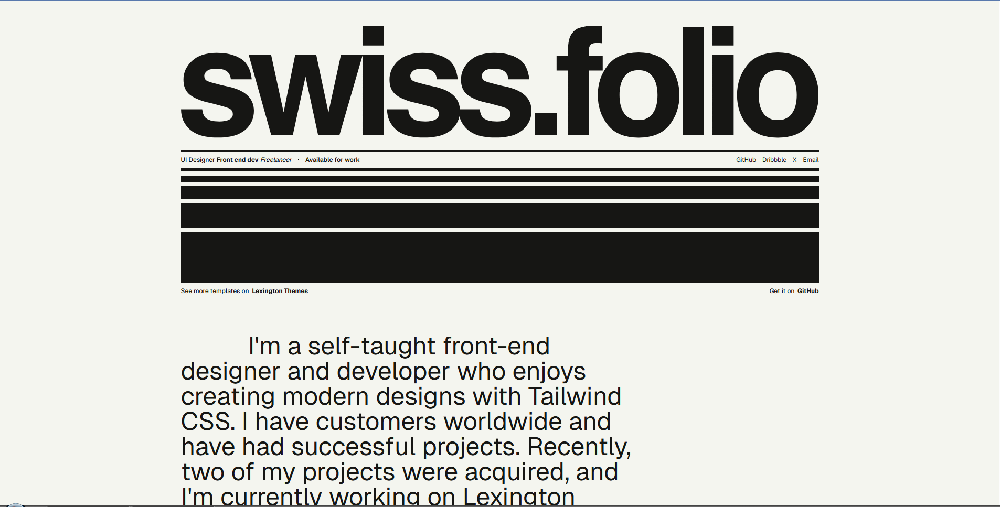

<p align="center">
  
</p>
# Astro Portfolio Collection 🚀

Welcome to the Astro Portfolio Collection! This repository contains 7 carefully selected portfolio templates to help you create your professional portfolio website quickly and easily.

## 🎯 About This Collection

This collection was created to help students and developers build beautiful, fast, and modern portfolio websites using Astro. Each template is pre-configured for Vercel deployment and ready to customize with your own content.

## 📚 Available Templates

### TypeScript Templates

#### 1. **Astro Sphere** 
A feature-rich portfolio with blog support, dark mode, and modern design. Perfect for developers who want a complete solution with blog, projects, and work experience sections.

**Features:** Blog, Projects, Work Experience, Search, Dark Mode  
**Tech:** Astro + Tailwind + Solid.js + TypeScript  
📁 [View Template](./astro-sphere/)
Live Demo: [https://astro-sphere-demo.vercel.app/](https://astro-sphere-demo.vercel.app/)

#### 2. **Minimal Bento Portfolio**
Trendy bento-box layout with smooth animations and interactive elements. Great for creatives who want a unique, eye-catching design.

**Features:** Bento Grid Layout, Animations (GSAP), Blog, SSR  
**Tech:** Astro + UnoCSS + Solid.js + Svelte + TypeScript  
📁 [View Template](./minimal-bento-portfolio/)

Live Demo: [Link](https://bue221.vercel.app/)


#### 3. **Astro Terminal (Astro Paper)**
Minimal, accessible blog theme with excellent typography and SEO. Ideal for writers and developers who prioritize content and readability.

**Features:** Blog, Dark Mode, Search, Accessibility, Syntax Highlighting  
**Tech:** Astro + Tailwind + TypeScript  
📁 [View Template](./astro-terminal/)

Live Demo: [Link](https://astro.build/themes/details/astro-terminal/)

#### 4. **Devolio**
Modern, minimalist portfolio built specifically for developers. Clean and professional design that showcases your technical skills.

**Features:** Project Showcase, Tech Stack Display, Clean Design  
**Tech:** Astro + Tailwind + TypeScript  
📁 [View Template](./devolio/)
Live Demo: [Link](https://devolio.devaradise.com/)
### JavaScript Templates

#### 5. **Astrofy**
Clean and beginner-friendly portfolio with CV, blog, projects, and optional store section. Great for those who want an all-in-one solution.

**Features:** CV/Resume, Blog, Projects, Services, Store (optional)  
**Tech:** Astro + Tailwind + JavaScript  
📁 [View Template](./astrofy/)
Live Demo: [Link](https://astrofy-template.netlify.app/)

#### 6. **LiteFolio**
Lightweight and minimal portfolio focused on simplicity and fast loading. Perfect for developers who want a straightforward, no-frills site.

**Features:** Minimal Design, Fast Loading, Easy Customization  
**Tech:** Astro + Tailwind + JavaScript  
📁 [View Template](./litefolio/)
Live Demo: [Link](https://litefolio.gonzalochale.com/)

#### 7. **Swissfolio**
Inspired by Swiss design principles with clean typography and grid-based layouts. Ideal for designers who appreciate timeless, elegant design.

**Features:** Swiss Design, Clean Typography, Grid Layout  
**Tech:** Astro + Tailwind + JavaScript  
📁 [View Template](./swissfolio/)
Live Demo: [Link](https://swissfolio.netlify.app/)

## 🚀 Getting Started

### Prerequisites

Before you begin, make sure you have:
- **Node.js 18 or higher** - [Download here](https://nodejs.org/)
- **Git** - [Download here](https://git-scm.com/)
- **A code editor** - We recommend [VS Code](https://code.visualstudio.com/)
- **A GitHub account** - [Sign up here](https://github.com/)
- **A Vercel account** - [Sign up here](https://vercel.com/) (free)

### Quick Start Guide

1. **Clone this repository**
   ```bash
   git clone <your-repo-url>
   cd astro-portfolio-collection
   ```

2. **Browse all templates**
   Try each template locally to see which one you like:
   ```bash
   cd astro-sphere
   npm install
   npm run dev
   ```
   Open `http://localhost:4321` in your browser

3. **Choose your favorite template**
   Explore all 7 templates and pick the one that fits your style!

4. **Delete the other templates**
   Keep only your chosen template:
   ```bash
   # Example: if you chose Astro Sphere
   rm -rf astrofy minimal-bento-portfolio litefolio swissfolio devolio astro-terminal
   ```

5. **Customize your chosen template**
   - Follow the README inside your template folder
   - Update your personal information
   - Add your projects and content
   - Replace images with your own

6. **Test locally**
   ```bash
   cd your-chosen-template
   npm install
   npm run dev
   ```

7. **Push to GitHub**
   ```bash
   git add .
   git commit -m "My portfolio"
   git push
   ```

8. **Deploy to Vercel**
   - Go to [vercel.com](https://vercel.com)
   - Click "New Project"
   - Import your GitHub repository
   - Click "Deploy"
   - Your site will be live in minutes!

## 📖 Detailed Workflow

### Step 1: Explore Templates

Each template folder contains:
- A complete, working Astro site
- A detailed README with customization instructions
- Pre-configured for Vercel deployment

Try running each template locally:
```bash
cd template-name
npm install
npm run dev
```

### Step 2: Choose and Customize

Once you've chosen your template:

1. **Read the template's README** - Each template has specific customization instructions
2. **Update configuration files** - Change site title, description, author info
3. **Add your content** - Projects, blog posts, work experience, etc.
4. **Replace images** - Profile photo, project screenshots, favicon
5. **Test thoroughly** - Make sure everything works locally

### Step 3: Deploy

Two deployment options:

**Option A: Single Template (Recommended)**
```bash
# Keep only your chosen template
# Move it to root or keep in folder
git add .
git commit -m "My portfolio"
git push
```

**Option B: Multiple Templates**
- Keep all templates in the repo
- In Vercel, set "Root Directory" to your chosen template folder

## 🎨 Choosing the Right Template

### For Bloggers & Writers
- **Astro Terminal (Astro Paper)** - Best for content-focused sites
- **Astro Sphere** - Great blog with additional portfolio features

### For Developers
- **Devolio** - Developer-specific design
- **Astro Sphere** - Complete developer portfolio
- **LiteFolio** - Simple and straightforward

### For Designers & Creatives
- **Minimal Bento Portfolio** - Unique, modern layout
- **Swissfolio** - Elegant, timeless design
- **Astrofy** - Versatile with many sections

### For Beginners
- **Astrofy** - Easy to understand and customize
- **LiteFolio** - Simple structure
- **Swissfolio** - Straightforward setup

## 🆘 Troubleshooting

### npm install fails
- Make sure you have Node.js 18+ installed: `node --version`
- Try deleting `node_modules` and `package-lock.json`, then run `npm install` again
- Check your internet connection

### Port already in use
- The dev server runs on port 4321 by default
- Kill the existing process or use a different port:
  ```bash
  npm run dev -- --port 3000
  ```

### Build fails on Vercel
- Check that all dependencies are in `package.json`
- Ensure Node.js version is set correctly in Vercel settings (18.x or higher)
- Check build logs for specific errors

### Images not loading
- Make sure images are in the `public/` folder
- Use correct paths (e.g., `/image.png` for files in public/)
- Check file names and extensions

### Template not working after customization
- Check browser console for errors
- Verify all required files are present
- Make sure you didn't accidentally delete important files
- Try reverting changes and applying them one at a time

## 📚 Resources

### Learning Resources
- [Astro Documentation](https://docs.astro.build) - Official Astro docs
- [Tailwind CSS Docs](https://tailwindcss.com/docs) - Styling framework
- [Markdown Guide](https://www.markdownguide.org) - For blog posts
- [Vercel Docs](https://vercel.com/docs) - Deployment platform

### Astro Tutorials
- [Astro Tutorial](https://docs.astro.build/en/tutorial/0-introduction/) - Official tutorial
- [Astro Blog](https://astro.build/blog/) - Latest updates and tips

### Design Inspiration
- [Awwwards](https://www.awwwards.com/) - Web design inspiration
- [Dribbble](https://dribbble.com/) - Design showcase
- [Behance](https://www.behance.net/) - Creative portfolios

## 🤝 Support

Need help? Here are your options:

1. **Check the template's README** - Each template has specific instructions
2. **Read the troubleshooting section** - Common issues and solutions
3. **Astro Discord** - [Join the community](https://astro.build/chat)
4. **GitHub Issues** - Report bugs or ask questions
5. **Event organizers** - Reach out to your event coordinators

## ✨ Tips for Success

1. **Start simple** - Don't try to customize everything at once
2. **Test frequently** - Run `npm run dev` often to catch errors early
3. **Use version control** - Commit your changes regularly
4. **Read the docs** - Each template's README has valuable information
5. **Ask for help** - Don't hesitate to reach out if you're stuck
6. **Have fun!** - Building your portfolio should be enjoyable

## 🎓 What You'll Learn

By building your portfolio with these templates, you'll gain experience with:
- Modern web development with Astro
- Component-based architecture
- Markdown for content
- Tailwind CSS for styling
- Git and GitHub for version control
- Vercel for deployment
- Web performance optimization
- SEO best practices

## 📝 Next Steps

After deploying your portfolio:

1. **Share it!** - Add the link to your GitHub profile, LinkedIn, resume
2. **Keep it updated** - Regularly add new projects and blog posts
3. **Monitor analytics** - Use Vercel Analytics to see your traffic
4. **Optimize** - Improve performance and SEO over time
5. **Customize further** - Make it truly yours with unique touches

## 🌟 Showcase

Built something awesome with these templates? We'd love to see it! Share your portfolio with the community.

---

**Happy coding!** 🎉

Built with ❤️ by [DSC SIST x skxdev](https://gdsc-base.framer.ai)
